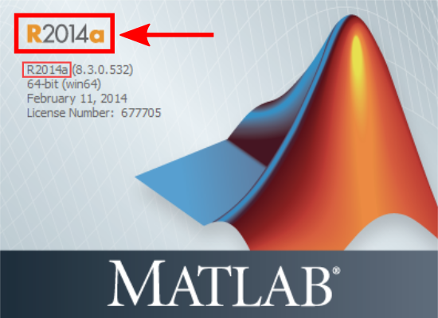

# segment-open -- Segment source distribution

## What is Segment?

Segment is a comprehensive software package for medical image analysis, [widely used in research](http://medviso.com/research/publication/).

Segment is developed with cardiovascular MRI (CMR) in mind, but it has also been validated using Cardiac CT and Myocardial Perfusion SPECT. The software package can also be used for a wide range of Radiology and Cardiology applications.

## What is the Segment Source Distribution?

The Segment source code is regularly exported from Medviso for free use by the academic research community, through the collaboration between Medviso AB and the Cardiac MR Group at Lund University, Sweden.
This forms the basis for segment-open, the Segment Source Distribution, which can be found in this repository.

Note that not all functionality in Segment is present in the Source Distribution, and the Source Distribution is neither FDA-approved nor CE-marked, and may not be used for clinical purposes.
Some parts of the code is protected (Matlab p-files).

## How do I use Segment?

 * Have a look in the folder [source/Docs](source/Docs)
 * The [user manual](source/Docs/manual.pdf) shows how to use the program. We also have some [tutorial videos on Medviso's Segment page](http://medviso.com/products/segment/).
 * If you want to develop your own plugins (or if you're just curious), the [tech manual](source/Docs/techmanual.pdf) shows how Segment works internally.

**It is strongly recommended to use Matlab R2014a.**
 * Performance of the GUI will be reduced with newer versions, as a new GUI framework was introduced in R2014b.
 * Using older versions may produce bugs due to non-existent functionality.
 * You can have several Matlab installations on the same computer at the same time.

## Contributions

We'd love to include your plugins in this repository! Please see the [Contributions Document](docs/CONTRIBUTING.md) for details, as well as the License and Terms of use below.

Found a bug? Do you have a feature request? Please let us know by [opening an issue in the tracker](https://github.com/Cardiac-MR-Group-Lund/segment-open/issues)!

## License and Terms of use

We recommend that you read the [full license agreement](LICENSE.md) before starting to use Segment. This section is just a short summary.

Segment is **freely available for academic research** in source and [binary](http://medviso.com/download2/) form, provided that you cite relevant publications and the usage of the software in your publications (see specific papers below).

The Segment Source Distribution may not be used for commercial or clinical applications.
The commercial, FDA-approved and CE-marked version of Segment is developed, marketed and sold by [Medviso AB, Lund, Sweden](http://medviso.com/).

We are happy to accept contributions to this source tree if you want to share your work with the world.
Write your code as a Segment plugin and submit your work as a pull request when you feel ready. Please see the [Contributions Document](docs/CONTRIBUTING.md) for details.

### What IS allowed?

Provided that you give proper attribution (see "Papers to cite" below), you can:

 * Use Segment for academic research
 * Publish results based on Segment
 * Write your own plugins
 * Share your plugins with others using the Segment source distribution

### What IS NOT allowed?

 * Clinical use
 * Commercial use
 * Distributing your own compiled version of Segment
 * For any of these cases, please contact Helen Fransson (CEO, Medviso AB, see contact info below)

## Papers to cite

According to the [license agreement](LICENSE.md), proper citation of required when you publish research based on Segment. A complete list is kept at the Medviso homepage: http://medviso.com/research/how-to-refer/

## Frequently asked questions

Q: What is the airspeed velocity of an unladen swallow?

A: African or European?

## Contact

| Who | Role |
| --- | --- |
| [Johannes Töger](mailto:johannes.toger@gmail.com) | Segment-open maintainer, Questions on distribution, Contributions, pull requests |
| [Einar Heiberg](mailto:einar@heiberg.se) | Segment creator, Medviso founder, Research collaborations with the Cardiac MR Group in Lund |
| [Helen Fransson](mailto:helen@medviso.com) | Medviso CEO, Clinical and commercial use of Segment |

