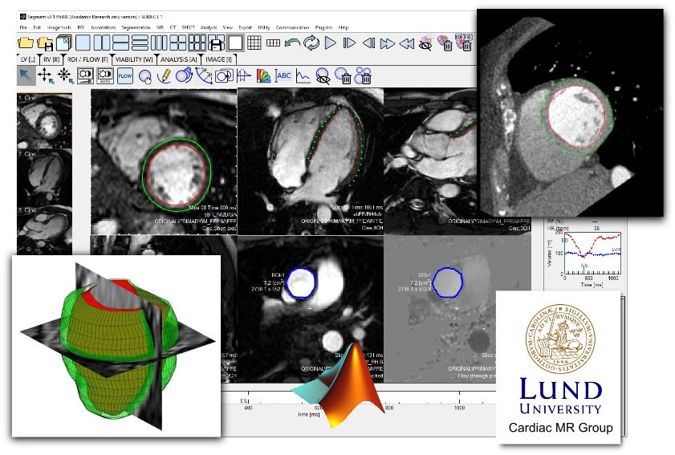

# segment-open -- Segment source distribution

## What is Segment?

Segment is a comprehensive software package for medical image analysis.
Segment is developed with cardiovascular MRI (CMR) in mind, but it has also been validated using Cardiac CT and Myocardial Perfusion SPECT. The software package can also be used for a wide range of Radiology and Cardiology applications.

## What is the Segment Source Distribution?

The Segment source code is regularly exported from Medviso for free use by the academic research community, through the collaboration between Medviso AB and the Cardiac MR Group at Lund University, Sweden.
This forms the basis for segment-open, the Segment Source Distribution, which can be found in this repository.

Note that not all functionality in Segment is present in the Source Distribution, and the Source Distribution is neither FDA-approved nor CE-marked, and may not be used for clinical purposes.
Some parts of the code is protected (Matlab p-files).

## Terms of use

Segment is **freely available for academic research** in source and [binary](http://medviso.com/download2/) form, provided that you cite relevant publications and the usage of the software in your publications (see specific papers below).

The Segment Source Distribution may not be used for commercial or clinical applications.
The commercial, FDA-approved and CE-marked version of Segment is developed, marketed and sold by [Medviso AB, Lund, Sweden](http://medviso.com/).

We are happy to accept contributions to this source tree if you want to share your work with the world.
Write your code as a Segment plugin and submit a pull request when you feel ready!

### What IS allowed?

Provided that you give proper attribution, you can:

 * Use Segment for academic research
 * Publish results based on Segment
 * Write your own plugins
 * Share your plugins with others using the Segment source distribution

### What IS NOT allowed?

 * Clinical use
 * Commercial use
 * Distributing your own compiled version of Segment

## Papers to cite

| Use/part  | Paper |
|-----------|-------|
| All use   | [Heiberg et al. BMC Med Imag 2010](https://bmcmedimaging.biomedcentral.com/articles/10.1186/1471-2342-10-1) |

## Frequently asked questions

Q: What is the airspeed of an unladen swallow?

A: African or European?

## Contact

| Who | Role |
| --- | --- |
| [Johannes Töger](mailto:johannes.toger@gmail.com) | Segment-open maintainer, Questions on distribution, Contributions, pull requests |
| [Einar Heiberg](mailto:einar@heiberg.se) | Segment creator, Medviso founder, Research collaborations with the Cardiac MR Group in Lund |
| [Helen Fransson](mailto:helen@medviso.com) | Medviso CEO, Clinical and commercial use of Segment |

